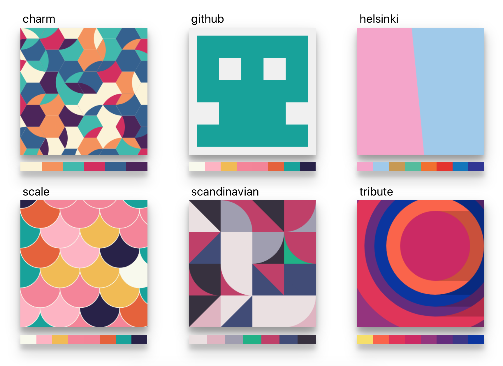

# Threes - Avatar as a Service
### Easily create avatars from a username - Avatar as a Service
***


<p align="center">
  
</p>

### Quickstart

#### Using Docker

```
# Clone the repository
git clone https://github.com/AlexGustafsson/threes.git && cd threes
# Build the Docker image
docker build -t threes:latest .
# Run the image
docker run -p 3000:3000 threes
```

#### Running from source

```
# Clone the repository
git clone https://github.com/AlexGustafsson/threes.git && cd threes
# Install dependencies
npm install
# Build the project
npm run build
# Start the server
npm run start
```

### Documentation

#### Deploying

The project is easily run by using Docker:

```
docker build -t threes:latest .
docker run -p 3000:3000 threes
```

Or directly using `npx`:

```
npx threes
```

#### API

The exposed API is versioned and documented using OpenAPI in the following files:
  * `api.v1.yml`

The API specifications can be used alongside software such as [Insomnia Designer or Insomnia Core](https://insomnia.rest/download/#mac) or the online [Swagger editor](https://editor.swagger.io).

##### Demo page

When run in development mode, a demo page is available to show all available styles. The demo page is available at `/demo` and shown in the image at the top of this document.

### Contributing

Any contribution is welcome. If you're not able to code it yourself, perhaps someone else is - so post an issue if there's anything on your mind.

#### Development

Clone the repository:
```
git clone https://github.com/AlexGustafsson/threes.git && cd threes
```

Set up for development:
```
npm install
```

Run the project in development mode with automatic compilation and server reload:
```
npm run dev
```

Follow the conventions enforced:
```
npm run lint
npm run test
npm run coverage
```

### Disclaimer

_The project is intended for production use but is not yet heavily battle-tested. As such there may be implications when running threes in larger environments._

_All styles and palettes implemented are heavily inspired by the creative work of others. Whenever possible the sources are referenced within the code. If you believe you are the creative owner of an implemented style and would like for it to be removed for any reason, please open an issue._
